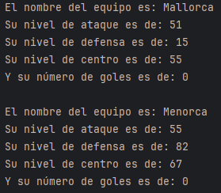
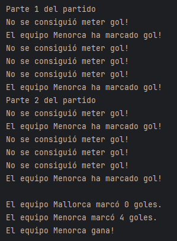

# retogit
El reto consitía en demostrar los conocimientos adquiridos en torno a GitHub tanto Desktop como web, consistiendo las fases de la actividad en:
- [x] Crear un repositorio nuevo que se llame retogit.
- [x] Realizar la subida de la carpeta src de un proyecto en java.
- [x] Crear una nueva rama llamada desarrolloPersona.
- [x] Descargar el contenido de la rama al repositorio local.
- [x] Crear una clase nueva y realizar la actualización de la rama en el repositorio, documentando este proceso con el comentario “Nueva clase – nombre de la clase”.
- [x] Modificar algún atributo de la clase nueva y realizar la actualización de la rama en el repositorio, documentando este proceso con el comentario “Edición clase – nombre de la clase”.
- [x] Realizar una comprobación de los cambios.
- [x] Fusionar la rama “desarrolloPersona” con la rama principal “main”.
- [ ] Realizar una publicación de este proceso en la página principal. Se valorará la calidad de la publicación, la variedad de etiquetas de MarkDown y como mínimo debe incluirse una imagen.

## Programa: Simulación de un partido de fútbol en Java
1. Equipo: la cual contará con las siguientes características:
  - Atributos:
    - Nombre (String)
    - nivelAtaque (int)
    - nivelDefensa (int)
    - nivelCentro (int)
    - numeroGoles(int)
  - Métodos:
    - Método constructor con parámetros solo con el parámetro nombre. El resto de atributos (nivelAtaque, nivelDefensa,nivelCentro) serán valores aleatorios del 0 al 100 inclusive.
    - Método constructor con todos los parámetros.
    - Método atacar que devuelve un booleano: Para ello es necesaria la siguiente lógica: True si la operación matemática Math.random()*2)) + ((this.nivelCentro * (int) (Math.random()*2))/2) es mayor de 70. False en caso contrario.
    - Método mostrarDatos, mostrando todos los datos.
    - getter/setter de todos los atributos.
   
2. Partido: la cual contará con las siguientes características:
  - Atributos:
    - equipoLocal ,equipoVisitante (es un objeto de la clase Equipo)
    - parteActual (int)
    - terminado (boolean)
  - Métodos:
    - Método constructor (Objeto de la clase Equipo (equipoLocal), objeto de la clase Equipo, equipoVisitante)
    - Método void marcarGol(Objeto de la clase Equipo (equipoLocal), objeto de la clase Equipo, equipoVisitante). En este método habrá que comprobar que si el método atacar devuelve true y el nivel de ataque del equipo que ataca es mayor al nivel de defensa del equipo que defiende, mostrará un mensaje de Gol del equipo … y apuntarse un gol.
    - Método void iniciarPartido(): Hay que jugar dos partes (como un partido normal de futbol) y en cada parte se tendrá que atacar 3 veces. Hay un bucle for anidado para ello. En cada ataque tendrás que llamar al método marcarGol(equipoLocal,equipoVisitante) y marcarGol(equipoVisitante, equipoLocal). En este método en el atributo terminado tendremos que almacenar true justo al final del método
    - Método void mostrarResultado(): comprobar si el partido ha sido terminado, en ese caso mostrar el resultado final. En caso contrario postrar el mensaje: “Sin jugar o jugando”.
    - Métodos Getter de getEquipoLocal(), getEquipoVisitante(), getParteAcual() y un método llamado isTerminado() que devuelva el valor del atributo terminado.
   
3. Jugador:
  - Atributos:
    - Nombre (String)
    - Posición (String)
    - Estrella (Boolean)
    - Calidad (int)
  - Métodos:
    - Constructor pidiendo por parámetros nombre, posición y calidad. Guardar true si calidad > 90, en caso contrario guardar false.
    - Método mostrarDatos(). Muestra todos los datos.
    - Métodos getters y setters de todos los atributos.
    - Método isEstrella que devuelve el valor de estrella (true/false)
   
4. Entrada (Todo dentro del main):
  - Crea un objeto de la clase partido donde recibirá por parámetros los dos equiposque has creado previamente.
  - Llama al método de la clase Partido iniciarPartido()
  - Llama al método de la clase Partido mostrarResultados():

## Ejemplo de ejecución:

> [!CAUTION]
> Te dejo al cargo de este gatito :black_cat: ¡Que no se te escape!
